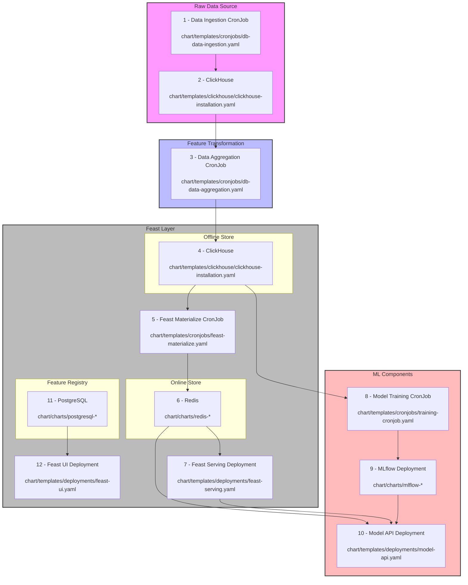

# pycon-lt-2025-demo

This repository contains a demo chart for PyCon LT 2025.



## Prerequisites

- [Orbstack](https://orbstack.dev/) installed and running
- [Helm](https://helm.sh/docs/intro/install/) installed
- [kubectl](https://kubernetes.io/docs/tasks/tools/) installed

## Building Docker Images

The chart requires two custom Docker images. Build them using the following commands:

1. Build the Feast application image:

   ```bash
   docker build -t localhost:5000/pycondemofeast:latest -f ./Dockerfile.feast .
   ```

2. Build the database migrations image:

   ```bash
   docker build -t localhost:5000/pycondemodbmigrations:latest -f ./Dockerfile.dbmigrations .
   ```

3. Start a local Docker registry (if not already running):

   ```bash
   docker run -d -p 5000:5000 --name registry registry:latest
   ```

4. Push the images to the local registry:

   ```bash
   docker push localhost:5000/pycondemofeast:latest
   docker push localhost:5000/pycondemodbmigrations:latest
   ```

## Running the Chart Locally with Orbstack

1. Start Orbstack and ensure it's running:

   ```bash
   orb start
   ```

2. Start the Kubernetes cluster:

   ```bash
   orb start k8s
   ```

3. Switch to the Orbstack context:

   ```bash
   kubectl config use-context orbstack
   ```

4. Create and switch to the pycondemo namespace:

   ```bash
   kubectl create namespace pycondemo
   kubectl config set-context --current --namespace=pycondemo
   ```

5. Install the ClickHouse operator (required for the chart to work):

   ```bash
   kubectl apply -f https://raw.githubusercontent.com/Altinity/clickhouse-operator/master/deploy/operator/clickhouse-operator-install-bundle.yaml
   ```

6. Install the chart:

   ```bash
   helm install pycondemo ./chart --namespace pycondemo
   ```

## Model Training

The chart includes a CronJob for dummy training of a model, which uses Feast offline store for feature extraction.
To trigger the training job:

```bash
kubectl create job --from=cronjob/pycondemo-training pycondemo-training-manual -n pycondemo
```

## Model inference

```bash
kubectl port-forward service/pycondemo-api 8000:8000
```

For endpoint using Feast Python SDK:

```bash
curl -X POST "localhost:8000/predict/python-sdk" \
  -H "Content-Type: application/json" \
  -d '{"entity_id": "AWS_eu-central-1_c5.large"}'
```

For endpoint using Feast server HTTP:

```bash
curl -X POST "localhost:8000/predict/http" \
  -H "Content-Type: application/json" \
  -d '{"entity_id": "AWS_eu-central-1_c5.large"}'
```

## Cleanup

To clean up all resources:

1. Uninstall the chart:

   ```bash
   helm uninstall pycondemo --namespace pycondemo
   ```

2. Delete the namespace:

   ```bash
   kubectl delete namespace pycondemo
   ```

3. Stop the Kubernetes cluster:

   ```bash
   orb stop k8s
   ```

4. Clean up registry:

   ```bash
   docker stop registry
   docker rm registry
   ```
